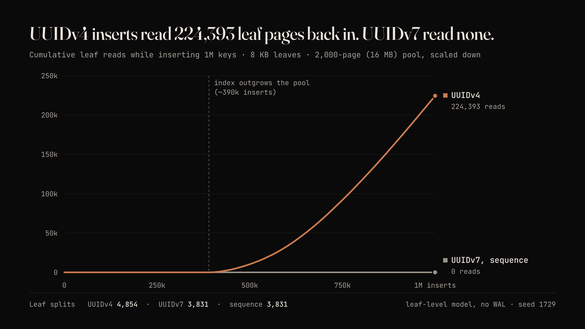

# UUIDv4 vs UUIDv7 in a B+tree

A leaf-level simulation of the layer 3 experiment. It inserts a million keys into B+tree leaves of about 290 keys each (an 8 KB page of 16-byte UUIDs), behind an LRU buffer pool of 2,000 pages. It counts splits, leaf fill, pages read back in, and pages written out.

```bash
python3 experiments/uuid-btree/sim.py            # 1M inserts, about 2 seconds
python3 experiments/uuid-btree/sim.py 200000     # fewer inserts
```

Results with seed 1729:

| keys | leaf splits | avg leaf fill | leaf reads | page writes |
|---|---|---|---|---|
| UUIDv4 | 4,854 | 71% | 224,393 | 227,248 |
| UUIDv7 | 3,831 | 90% | 0 | 1,832 |
| sequence | 3,831 | 90% | 0 | 1,832 |



The pool is deliberately small (16 MB) so a million rows is enough to outgrow it. In a real database the limit is `shared_buffers` plus the OS page cache.

What it leaves out: the WAL and the full-page images Postgres writes after each checkpoint (random keys make those worse too), internal pages, the heap, and Postgres's clock-sweep eviction (LRU stands in for it). UUIDv7 is modelled as one steady insert stream at about 10 keys per millisecond. Change `POOL` and `CAP` at the top of the file to try other shapes.
